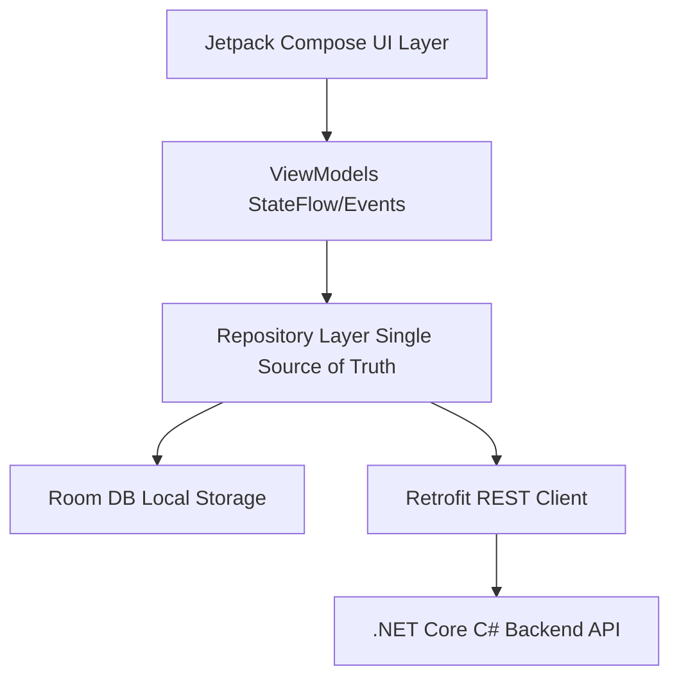

# E-Park Android Implementation Plan 🚗💨

This document outlines the master technical and visual implementation plan to translate the **E-Park Justinmind prototype** (located in the `./epark` directory) into a production-ready, fully native **Kotlin Android Application** using **Jetpack Compose** and **Material 3**.

---

## 🎨 1. Branding & Design System (Tokens)

The design system has been extracted directly from the CSS templates of the Justinmind prototype. It features a modern, clean, and vibrant **green-centric theme** symbolizing fluid urban mobility.

### 🟢 Color Palette
In Jetpack Compose, these colors will be defined inside `ui/theme/Color.kt`:

| Token Name | Hex Code | Compose Representation | UI Usage |
| :--- | :--- | :--- | :--- |
| **Primary Green** | `#20AC76` | `Color(0xFF20AC76)` | Primary buttons, headers, active tabs, main accents |
| **Soft Mint Accent** | `#B7EECF` | `Color(0xFFB7EECF)` | Highlighted card backgrounds, selection chips |
| **Gradient Start** | `#BEF4C9` | `Color(0xFFBEF4C9)` | Top-level welcome/login gradient backgrounds |
| **Gradient End** | `#FFFFFF` | `Color(0xFFFFFFFF)` | Bottom-level background base |
| **Background Base** | `#FFFFFF` | `Color(0xFFFFFFFF)` | Scaffold background, card content area |
| **Surface Dark** | `#404040` | `Color(0xFF404040)` | Drop shadows, high-contrast subtitles, boundaries |
| **Text Primary** | `#000000` | `Color(0xFF000000)` | Headings, titles, main body text |
| **Error / Alert** | `#E53935` | `Color(0xFFE53935)` | Fine alerts, cancel actions, warning dialogs |

### 📐 Shapes & Spacing
- **Corners**: UI cards, inputs, and dialogs in the prototype use a distinct rounded corner profile of `14px` (`border-radius: 14px`). In Kotlin, we will model this using `RoundedCornerShape(14.dp)` to preserve the friendly, premium aesthetic.
- **Shadows**: Cards utilize a soft drop shadow (`#404040` with 5px blur). In Compose, we will use `Modifier.shadow(elevation = 4.dp, shape = RoundedCornerShape(14.dp), clip = false)`.
- **Typography**: The primary typeface is **Inter** (`Inter_20.0.0_google`). We will integrate this using the Google Fonts API in `ui/theme/Type.kt` for sleek, premium typography across all text weights (Regular, Medium, Bold).

---

## 🏗️ 2. Technical Architecture & Stack

To build a robust, scalable, and testable codebase, the app will strictly adhere to modern Android development standards:

1. **UI Layer**: Jetpack Compose using Material 3 and adaptive layout libraries (like `NavigationSuiteScaffold` already present in `MainActivity.kt`).
2. **Navigation**: Jetpack Compose Navigation with type-safe route definitions.
3. **State Management**: MVVM Pattern. ViewModels will hold UI states in `StateFlow` and handle interactions via one-way `UserIntent` streams.
4. **Local Data Caching (Offline Mode)**:
   - **Room DB**: Persistently stores registered vehicles, session histories, active zone data, and issued fines.
  - **Jetpack DataStore**: Saves user preferences, JWT access tokens, current active session identifiers, and user roles (Driver vs. Admin).
5. **Network Layer**: **Retrofit** combined with **OkHttp** for logging/interceptors, and **Kotlinx Serialization** for high-performance JSON mapping to the C# .NET API.
6. **Asynchronous Engine**: **Kotlin Coroutines** for background queries and **Flows** for observing database changes in real-time (e.g., active timers).
7. **Persistent Background Tasks**: **WorkManager** to handle countdown clocks, notifications, and auto-extensions, ensuring they trigger even if the system kills the app.

---

## 📱 3. Screen-by-Screen Mapping & UI Breakdown

The Justinmind prototype defines **29 unique screens** divided into two roles: **Driver (Normal User)** and **Municipal Admin**. Below is the mapping of each prototype screen to its Kotlin Composable component.

### 🚗 A. User Auth & Registration Flow

#### 1. Iniciar Sesión (Login)
- **Snapshot File**: `d12245cc-1680-458d-89dd-4f0d7fb22724.png`
- **Compose Component**: `LoginScreen`
- **Design Details**: Soft linear gradient background (`#BEF4C9` to `#FFFFFF`). Centered logo/branding (`#B7EECF` circular badge), rounded username and password input boxes with visual feedback (`14.dp`), and a bold `#20AC76` login button.
- **Interactions**: Tapping login authenticates via API, saves the JWT to DataStore, and navigates to the Driver Home or Admin Zonas depending on user role.

#### 2. Registrar (Register)
- **Snapshot File**: `92922524-9adf-413d-80b7-c44c3f7b8cd8.png`
- **Compose Component**: `RegisterScreen`
- **Design Details**: Similar welcoming mint-to-white gradient. Form fields for Full Name, Email, Password, and Phone Number.
- **Interactions**: Submits data to the registration API. On success, transitions to the Account Success screen.

#### 3. Crear Cuenta Éxito (Register Success)
- **Snapshot File**: `bf58a5f6-2528-4885-ac9d-248e7a281073.png`
- **Compose Component**: `RegisterSuccessScreen`
- **Design Details**: Full screen success green checkmark graphic, positive copy highlighting that the account has been created.
- **Interactions**: "Continue" button directs the user to register their first vehicle (`usuario.registroCarro`).

#### 4. Salir (Exit/Logout)
- **Snapshot File**: `e093d0ef-53b2-48ab-a315-04f4b586dcbc.png`
- **Compose Component**: `LogoutConfirmationDialog`
- **Design Details**: Modal dialog or full screen confirmation overlay asking the user if they want to log out.
- **Interactions**: Confirms logout, purges DataStore credentials/tokens, clears the backstack, and redirects to `LoginScreen`.

---

### 🚙 B. Driver Vehicle Registration Flow

#### 5. Registro Carro (Register Vehicle Part 1)
- **Snapshot File**: `f17f71f6-5f62-40b4-b0a1-35f271024fbd.png`
- **Compose Component**: `RegisterVehicleStep1Screen`
- **Design Details**: Plate text field, vehicle nickname input, and vehicle type dropdown selection (Car, Motorcycle, Truck).
- **Interactions**: Validates plate format. Next button moves to Step 2.

#### 6. Registro Carro 2 (Register Vehicle Part 2)
- **Snapshot File**: `17249bd7-015f-468d-8d2b-f218a0507cc0.png`
- **Compose Component**: `RegisterVehicleStep2Screen`
- **Design Details**: Interactive color selector grid, vehicle brand, and model details input.
- **Interactions**: Saves the vehicle details both locally in the Room DB and calls the remote backend API. Proceeds to Driver Home.

---

### 🗺️ C. Driver Parking & Active Sessions

#### 7. Usuario Home (Driver Home / Map)
- **Snapshot File**: `cd24606e-37f2-4c10-a17b-00d78eb03e9b.png`
- **Compose Component**: `DriverHomeScreen`
- **Design Details**: Integrates Google Maps API or a custom map component showing municipal parking zones. Floating bottom sheet with current geolocation, selected zone card, and a prominent "Start Parking" call to action. Header displays user avatar and active notifications badge.
- **Interactions**: Tapping on a zone shows hourly rates. Floating Action Button (FAB) toggles zone details. Tapping "Start Parking" triggers vehicle selection.

#### 8. Usuario Seleccionar Vehículo (Select Vehicle Bottom Sheet/Popup)
- **Snapshot File**: `cac433cf-8040-4243-8a11-e1d4f6749193.png`
- **Compose Component**: `VehicleSelectionDialog`
- **Design Details**: A clean bottom drawer displaying user's saved vehicles as horizontal chips or list items with plate numbers and icons. Includes a quick "+" shortcut to add a new vehicle.
- **Interactions**: Tapping a vehicle selects it as active for the parking session and navigates to the session configuration page.

#### 9. Usuario Sesión (Session Configuration)
- **Snapshot File**: `38bd7dcf-0969-475f-870f-c1238e4912e8.png`
- **Compose Component**: `SessionConfigScreen`
- **Design Details**: Zone info display, vehicle details summary. Features an interactive duration picker (plus/minus controls or scrollable hours/minutes dial). Displays real-time cost calculation based on rate.
- **Interactions**: "Pay & Start" button navigates to Payment Methods or directly to Pago Sesión.

#### 10. Usuario Pago Sesión (Session Payment Screen)
- **Snapshot File**: `f410819e-4cc3-48ea-a8b2-5e7d1f828b28.png`
- **Compose Component**: `PaymentConfirmationScreen`
- **Design Details**: Summary of parking session (Zone, Plate, Start Time, End Time, Total Amount). Card showing the selected credit card/payment method.
- **Interactions**: "Confirm Payment" triggers Retrofit API payment endpoint, updates the active session status, and triggers a countdown.

#### 11. Usuario Pago Éxito (Payment Success Feedback)
- **Snapshot File**: `2a7ccc36-630e-4717-b759-c18b70d4cb7b.png`
- **Compose Component**: `PaymentSuccessScreen`
- **Design Details**: Animated green checkmark, invoice download shortcut, and details of the running session.
- **Interactions**: "View Active Timer" navigates directly to `usuario.sesionActivo`.

#### 12. Usuario Sesión Activo (Active Parking Timer)
- **Snapshot File**: `47a5d143-f765-4bf4-9ed0-d1608b3a033a.png`
- **Compose Component**: `ActiveSessionScreen`
- **Design Details**: Circular countdown graphic representing remaining time. Large, pulsing digits showing `HH:MM:SS`. Warning backgrounds that shift from calming mint green (`#B7EECF`) to warning yellow/red as the timer gets below 15 minutes.
- **Interactions**: Includes buttons for "Extend Session" (`usuaurio.extenderSesion`) and "Stop Session Early" (which calculates refundable/remaining balances if supported).

#### 13. Usuario Extender Sesión (Extend Active Session)
- **Snapshot File**: `a6ab8b36-ad82-4979-850f-cfafaed5231f.png`
- **Compose Component**: `ExtendSessionScreen`
- **Design Details**: Compact time picker overlay adding extra 15, 30, or 60-minute blocks to the current countdown. Displays incremental pricing.
- **Interactions**: Triggers payment confirmation for the extended time, then seamlessly increments the active background timer.

---

### 💳 D. Driver Profile, Settings & Fines

#### 14. Usuario Historial (Parking & Payments History)
- **Snapshot File**: `6d3568a6-761e-42c0-987b-33a5e7c38dca.png`
- **Compose Component**: `ParkingHistoryScreen`
- **Design Details**: A beautifully formatted list showing completed sessions. Each card contains the date, elapsed duration, zone name, vehicle plate, and a PDF receipt icon.
- **Interactions**: Clicking a card opens detailed receipt view. Pull-to-refresh queries the backend for updated transactions.

#### 15. Usuario Perfil (User Profile Hub)
- **Snapshot File**: `fe1bafc1-757f-4310-8af0-52e50263fc48.png`
- **Compose Component**: `ProfileScreen`
- **Design Details**: Rounded user avatar at the top. Elegant navigation options: Personal Information (`usuario.editar`), Payment Methods (`usuario.metodoDePago`), Saved Vehicles (`usuario.agregarVehiculo` list), and Active Fines (`usuario.multas`).
- **Interactions**: Smooth navigation transitions between settings menus.

#### 16. Usuario Editar (Edit Profile)
- **Snapshot File**: `26c999ff-09c7-4e11-ad96-893d4d68c98d.png`
- **Compose Component**: `EditProfileScreen`
- **Design Details**: Prefilled form fields (Name, Phone, Email, Password change toggle).
- **Interactions**: Save button triggers profile update request, triggers a local Room cache sync, and displays a success toast.

#### 17. Usuario Agregar Vehículo (Manage / Add Vehicle)
- **Snapshot File**: `af1891dd-3e58-423d-8300-2a0bc5dab5f6.png`
- **Compose Component**: `AddVehicleScreen`
- **Design Details**: Form inputs for Plate Number, Color, Model, and Brand.
- **Interactions**: Saves vehicle to local Room database and synchronizes with API backend.

#### 18. Usuario Método de Pago (Payment Methods List)
- **Snapshot File**: `637002e2-5838-4aa0-af0a-8235d7ef3d07.png`
- **Compose Component**: `PaymentMethodsScreen`
- **Design Details**: Displays cards (Visa, Mastercard, etc.) with masked numbers (`**** **** **** 1234`), expiry dates, and a primary selector checkbox.
- **Interactions**: Ability to set a default payment method, delete existing cards, or add a new one (`usuario.agregarPago`).

#### 19. Usuario Agregar Pago (Add Payment Method Details)
- **Snapshot File**: `66285efd-bbc1-4ffa-9104-16d14f523ca3.png`
- **Compose Component**: `AddCardScreen`
- **Design Details**: Card scanner placeholder / visual mock input representing credit card number, holder name, CVV, and expiration date.
- **Interactions**: Submits encrypted card token to payment processor API. Saves card metadata locally.

#### 20. Usuario Notificaciones (Notification Center)
- **Snapshot File**: `3347ff7f-0fec-4de4-9719-5711f19aaecf.png`
- **Compose Component**: `NotificationsScreen`
- **Design Details**: List of push notification logs (e.g. "Your session in Zone A is about to expire", "New Fine Issued for Plate XYZ"). Tapping a notification navigates to the relevant screen.

#### 21. Usuario Multas (User Fines List)
- **Snapshot File**: `f9187d3e-8d35-41ba-b0ca-6072cd15ffc2.png`
- **Compose Component**: `UserFinesScreen`
- **Design Details**: Warning red badge displaying the count of unpaid infractions. Displays detailed cards including plate numbers, date, location/zone, penalty fee, and payment status.
- **Interactions**: Tapping an unpaid fine opens the payment details screen (`usuario.pagarMulta`).

#### 22. Usuario Pagar Multa (Infraction Payment)
- **Snapshot File**: `073ae193-64be-4c77-8186-2e74d314f7bf.png`
- **Compose Component**: `PayFineScreen`
- **Design Details**: Ticket summary, breakdown of interest fees or early-payment discounts. Choice of credit card.
- **Interactions**: "Pay Infraction" executes payment API call. Success updates the infraction status to 'Paid' in both backend and Room databases, clearing user warnings.

---

### 👮 E. Admin Features

#### 23. Admin Zonas (Admin Zones Dashboard)
- **Snapshot File**: `d626423a-04cf-45bb-b4ae-07280ca290aa.png`
- **Compose Component**: `AdminZonesScreen`
- **Design Details**: Map overlay highlighting municipal administrative zones. List of active zones showing slot occupancy ratios (e.g., "Zone Centrica: 85% full"). Includes quick search field for plates.
- **Interactions**: Selecting a zone shows active vehicles, spot details, and logs. Includes shortcut to add a zone (`admin.agregarZona`). Search searches database for plate registration.

#### 24. Admin Reportes (Admin Analytics)
- **Snapshot File**: `42d18d8e-6f5d-41aa-bf3b-7f182907819f.png`
- **Compose Component**: `AdminReportsScreen`
- **Design Details**: Visual graphs (bar charts, line graphs) showing collections by day, occupancy curves, and fine distributions. Beautiful glassmorphic summary cards (Total Revenue, Active Fines, Active Spots).
- **Interactions**: Date range picker dynamically queries collection stats.

#### 25. Admin Multas (Fine Operations)
- **Snapshot File**: `767e0479-a760-4ef1-bd16-4eb22e87d279.png`
- **Compose Component**: `AdminManageFinesScreen`
- **Design Details**: List of all issued infractions. Includes floating action button "+" to create/issue a new fine.
- **Interactions**: Opens ticket creation dialog, requiring plate input, photo upload (via camera integration), zone ID, and reason dropdown.

#### 26. Admin Alerta (Fine Success Confirmation)
- **Snapshot File**: `7f421ace-e30f-464c-9615-c114d32005fb.png`
- **Compose Component**: `FineSuccessDialog`
- **Design Details**: Pop-up window displaying ticket confirmation details: "Infraction successfully registered under ticket #XXXX". Includes direct sharing button (print or email).

#### 27. Admin Agregar Zona (Create Parking Zone)
- **Snapshot File**: `4e52b4f9-39f4-4764-8449-31aee943f5bc.png`
- **Compose Component**: `AddZoneScreen`
- **Design Details**: Fields for Zone Name, GPS Center coordinates (Latitude/Longitude picker), Slot Capacity, and Hourly Rate.
- **Interactions**: Validates coordinates and inserts zone into central map database.

#### 28. Admin Gestionar Zona (Edit Parking Zone)
- **Snapshot File**: `bcc1c172-017c-4ed8-bf16-7e5b9371c2b0.png`
- **Compose Component**: `ManageZoneScreen`
- **Design Details**: Prepopulated form fields with statistics: current occupancy, historical revenue. Buttons to toggle zone active/inactive state or modify hourly rates.

#### 29. Admin Alerta Example (System Alert Popups)
- **Snapshot File**: `261e4db5-7111-410e-b5e1-1e17e321c96d.png`
- **Compose Component**: `SystemAlertScreen`
- **Design Details**: Templates for critical warning dialogs (e.g. "Network lost", "Printer device disconnected", "Database synchronization pending").

---

## ⚙️ 4. Functional & Utility Requirements (Pending Implementation)

To transition from a static design to a functional app, we must develop the following background services and business logic engines:

### ⏱️ A. Real-Time Countdown Timer Engine
A core requirement for drivers is tracking their remaining parking time.
- **Implementation**: We will create a `ParkingSessionService` backed by Android's **WorkManager** and **Foreground Services** (with a persistent notification).
- **Behavior**:
  - The countdown will run in the background, updating a Live Notification containing progress and remaining minutes.
  - When the session reaches **15 minutes** remaining, a high-priority warning push notification is fired.
  - At **5 minutes** remaining, a critical sound warning alerts the driver, offering a quick action button to **Extend Session**.
  - If the timer hits `00:00:00`, a final notification alerts the driver that the session has expired to prevent getting a fine.

### 💳 B. Mock/Integration Payment Gateway
To support checking out sessions and paying fines, the application needs a secure billing module.
- **Implementation**: Integration with Stripe SDK or a simulated local bank simulator gateway class (`BankPaymentProcessor`).
- **Data Security**: Credit card numbers will be verified using Luhn's algorithm on the device. Sensitive credit card numbers will never be stored locally; only a secure transaction token and visual masking details (`Visa **** 1234`) will reside in Room.

### 🛜 C. Offline Caching & Sync (Room + API Sync)
The app must remain operational in areas with poor cellular signal (e.g. underground parking levels).
- **Implementation**:
  - When a Driver opens the app, the local **Room DB** serves cached parking histories and vehicle configurations instantly.
  - Active session countdowns will rely on local system-time elapsed calculations rather than polling server APIs constantly.
  - If an admin issues a fine offline, the fine is written to a Room table marked as `pending_sync = true`. A **WorkManager PeriodicWorkRequest** runs in the background to automatically upload offline data to the C# .NET API once network connection is recovered.

---

## 📡 5. Backend C# .NET API Integration Blueprint

To replace the placeholder weather endpoints inside the backend (`api/eparkapi/Program.cs`), the Kotlin app will require the following REST API endpoints:

### 👤 1. Authentication (`/api/auth`)
- `POST /api/auth/login`: Authenticate email/password. Returns JWT and user role (`Driver` / `Admin`).
- `POST /api/auth/register`: Create a new driver account.
- `PUT /api/auth/profile`: Update name, phone, or password.

### 🚗 2. Vehicles (`/api/vehicles`)
- `GET /api/vehicles`: Retrieves saved vehicles for the authenticated driver.
- `POST /api/vehicles`: Registers a new plate.
- `DELETE /api/vehicles/{plate}`: Removes a vehicle.

### ⏱️ 3. Parking Sessions (`/api/sessions`)
- `GET /api/sessions/active`: Retrieves current active session parameters (end timestamp, zone, rate).
- `POST /api/sessions/start`: Creates a parking session. Computes fee and deducts balance/charges card.
- `POST /api/sessions/extend`: Extends active session by a specified time block.
- `GET /api/sessions/history`: Fetches past session invoices.

### 💸 4. Fines / Infractions (`/api/fines`)
- `GET /api/fines/user`: Lists tickets associated with the driver's registered plates.
- `POST /api/fines/pay/{id}`: Processes payment for an outstanding ticket.
- `POST /api/fines/issue` *(Admin only)*: Creates an infraction ticket (parameters: plate, location, photo, violation reason).

### 📍 5. Zones (`/api/zones`)
- `GET /api/zones`: Fetches parking zones inside the city, coordinates, limits, and pricing.
- `POST /api/zones` *(Admin only)*: Registers a new parking sector.
- `PUT /api/zones/{id}` *(Admin only)*: Edits slot capacity or active status.

---

## 📋 6. Action Checklist & Phased Roadmap

To manage project progress, we have organized the implementation of the E-Park application into five clear milestones.

### Phase 1: Core Foundation & Design System (Tokens)
- [ ] Initialize Jetpack Compose theme configuration in `ui/theme`.
  - [ ] Add branding color tokens (`PrimaryGreen`, `SoftMint`, gradients) inside `Color.kt`.
  - [ ] Configure `Type.kt` to load Google's **Inter** font family dynamically.
  - [ ] Define standard card elevations and shapes (`RoundedCornerShape(14.dp)`) in `Shape.kt`.
- [ ] Establish network layer package: Setup `Retrofit` builder with authentication header interceptor.
- [ ] Establish local database layer: Build `AppDatabase` schema using `Room` (Entities: `Vehicle`, `ParkingSession`, `Fine`).

### Phase 2: User Authentication & Onboarding (Screens 1-6)
- [ ] Implement `LoginScreen` (`iniciar sesion`) including JWT extraction and DataStore token persistence.
- [ ] Implement `RegisterScreen` (`registrar`) and connection with registration endpoints.
- [ ] Implement `RegisterSuccessScreen` (`Crear cuenta exito`).
- [ ] Create multi-step vehicle registration forms: `RegisterVehicleStep1Screen` and `RegisterVehicleStep2Screen`.

### Phase 3: Driver Core Utilities (Screens 7-13)
- [ ] Implement `DriverHomeScreen` featuring interactive map integration and sector listing.
- [ ] Build vehicle selection dropdown sheet (`VehicleSelectionDialog`).
- [ ] Build active session builder: `SessionConfigScreen` with sliding duration selectors.
- [ ] Program payment authorization screen (`PaymentConfirmationScreen`) and successful confirmation banner (`PaymentSuccessScreen`).
- [ ] Develop the persistent **Real-time Countdown Engine** utilizing Android `WorkManager` & Foreground Service for live notifications.
- [ ] Code active countdown dashboard (`ActiveSessionScreen`) with responsive yellow/red alert states.

### Phase 4: Profiles, History & Fine Payments (Screens 14-22)
- [ ] Design transaction list screen (`ParkingHistoryScreen`) showing past session receipts.
- [ ] Develop profile management screens: `ProfileScreen`, `EditProfileScreen`, and `PaymentMethodsScreen`.
- [ ] Program credit card tokenization visual interface (`AddCardScreen`).
- [ ] Build `UserFinesScreen` (unpaid fines count alert) and fine payment wizard (`PayFineScreen`).

### Phase 5: Municipal Admin Dashboard & Analytics (Screens 23-29)
- [ ] Implement the admin portal `AdminZonesScreen` including search tools for active parked plates.
- [ ] Create graphical collection/occupancy charts in `AdminReportsScreen`.
- [ ] Build administrative fine tool: `AdminManageFinesScreen` with camera integration for ticket evidence, and success popup `FineSuccessDialog`.
- [ ] Develop zone management screens: `AddZoneScreen` and `ManageZoneScreen`.
- [ ] Integrate global error templates `SystemAlertScreen` to notify network drops and printer issues.

---

> [!NOTE]
> This native Kotlin architecture is designed to map 1:1 with the interactive states of the Justinmind prototype. By using Jetpack Compose, the transition animations between states will feel premium and responsive.
